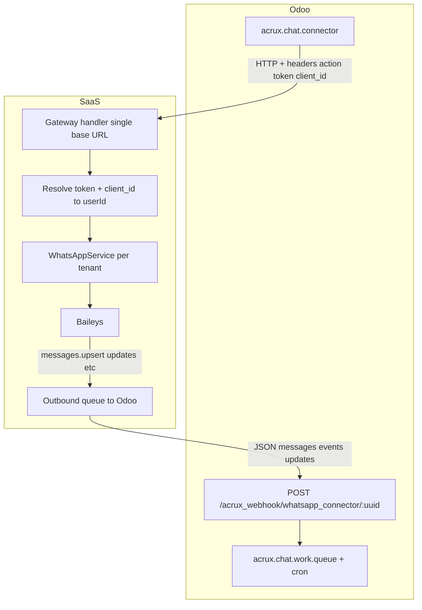

# Production-ready plan: Odoo ChatRoom (third-party modules) ↔ Baileys SaaS

**Goal:** Run unmodified [`whatsapp_connector`](odoo-modules/whatsapp_connector/) (BASE) against **your** gateway, then enable [`whatsapp_connector_crm`](odoo-modules/whatsapp_connector_crm/) and [`whatsapp_connector_sale`](odoo-modules/whatsapp_connector_sale/) once BASE is stable.

**Non-goals (v1):** Facebook / Instagram / Waba Extern connector types (`Connector.is_owner_facebook()`, separate action maps). Odoo **Free Test / init_free_test** flows tied to Acrux hosts — replace with your **tenant provisioning** UX.

**Source of truth:** Python in `odoo-modules/whatsapp_connector/models/` and `controllers/main.py`. Do not resurrect deleted `odoo-modules/AGENTS.md`.

---

## 1. Preconditions (production)

| Requirement | Why |
|-------------|-----|
| Odoo **`web.base.url`** (or connector **`odoo_url`**) is a **public HTTPS** origin | Odoo must receive **your server’s** POSTs to `/acrux_webhook/whatsapp_connector/<uuid>`; localhost breaks inbound. |
| Valid TLS on both Odoo and SaaS | Odoo connector has **`verify`** on outbound requests; mismatched certs cause hard failures. |
| Clock sync (NTP) | Token/session debugging and log correlation. |

---

## 2. Target architecture



**Traffic direction**

- **Odoo → SaaS:** All connector operations via **`ca_request`** → one **`endpoint`** URL, **`action`** header ([`Connector.get_headers`](odoo-modules/whatsapp_connector/models/Connector.py)).
- **SaaS → Odoo:** Your process **pushes** JSON to `{odoo_url}/acrux_webhook/whatsapp_connector/{uuid}` ([`WebhookController`](odoo-modules/whatsapp_connector/controllers/main.py)). There is **no pull** from Odoo.

---

## 3. Credential and data model (SaaS)

**Odoo fields to mirror server-side**

- **`uuid`** (`client_id` header) — unique public connector id per tenant (string; Odoo requires unique).
- **`token`** — shared secret (header `token`); store **hash + prefix** like existing API keys ([`IntegrationCredential`](prisma/schema.prisma)), never log full value.

**Prisma (conceptual — implementation phase)**

- Extend **`IntegrationCredential`** **or** add **`OdooGatewayCredential`** with:
  - `userId` (unique)
  - `connectorUuid` (unique) — matches Odoo `uuid` / `client_id`
  - `tokenHash`, `tokenPrefix`
  - `odooWebhookBaseUrl` — optional cache of last `config_set.webhook` origin for diagnostics
  - `configSetPayload` (Json, optional) — last `config_set` body or parsed `{ webhook, info }` for retry logic
- Keep existing **`webhookUrl`** / **`webhookSecret`** if you still support the **flat** HMAC integration; **Odoo path** uses the URL from **`config_set`** (`webhook` field), not necessarily the dashboard field — **single policy**: either migrate dashboard to show “Odoo registers webhook via config_set” or sync stored URL when `config_set` arrives.

**Provisioning (production UX)**

1. User completes subscription → server generates **`uuid` + token** (plaintext shown once).
2. User pastes into Odoo connector **`Account ID`** / **`Token`** and sets **`API Endpoint`** to your gateway base URL.
3. User sets **`Odoo Url (WebHook)`** to their public Odoo base (required for **`config_set`** and for your server to know where to POST — see §6).

---

## 4. Gateway HTTP surface (contract)

**Single base URL** (example): `https://{saas}/api/gateway/v1` — **no path suffix** for non-Facebook connectors ([`get_api_url`](odoo-modules/whatsapp_connector/models/Connector.py): returns `endpoint.strip('/')` only).

**Headers (every request)**

| Header | Value |
|--------|--------|
| `Accept` | `application/json` |
| `Content-Type` | `application/json` (Odoo sends even on GET — acceptable for `requests`) |
| `token` | Connector secret |
| `client_id` | Connector `uuid` |
| `action` | One of [`get_actions`](odoo-modules/whatsapp_connector/models/Connector.py) keys |

**Method by `action` (apichat.io)**

| action | HTTP | Body | Query params |
|--------|------|------|----------------|
| `send` | POST | JSON from [`message_parse`](odoo-modules/whatsapp_connector/models/Message.py) | — |
| `msg_set_read` | POST | JSON (phone/chat_type etc.) | — |
| `config_get` | GET | — | optional |
| `config_set` | POST | `{ webhook, info }` | — |
| `status_get` | GET | — | — |
| `status_logout` | POST | `{}` ([`hook_request_args`](odoo-modules/whatsapp_connector/models/Connector.py)) | — |
| `contact_get` | GET | — | `chatId` ([`Conversation`](odoo-modules/whatsapp_connector/models/Conversation.py)) |
| `contact_get_all` | GET | — | — |
| `whatsapp_number_get` | GET | — | `numbers` |
| `template_get` | GET | — | per Odoo caller |
| `opt_in` | POST | — | if used |
| `init_free_test` | POST | — | **skip / 501** in v1; use your provisioning |
| `delete_message` | DELETE | — | `number`, `msg_id`, `for_me`, `from_me` ([`Conversation.delete_message`](odoo-modules/whatsapp_connector/models/Conversation.py)) |

**Success response**

- **`200`** with JSON body. Parser uses **`req.json()`** ([`response_handler`](odoo-modules/whatsapp_connector/models/Connector.py)); non-JSON on 200 is fragile — always return JSON.

**Error response (must align with Odoo)**

- **`get_request_error_message`** maps **202 / 204 / 400 / 403 / 404 / 500** to user-visible errors using JSON **`error`** when present. Prefer **`400`** + `{ "error": "human readable" }` for validation; **`403`** for bad `token`/`client_id`; **`500`** only for true internal faults.

**Critical response shapes**

- **`send`:** `{ "msg_id": "<string>" }` — required or Odoo message row may not get [`msgid`](odoo-modules/whatsapp_connector/models/Message.py).
- **`status_get`:** `{ "status": { ... } }` — see §5.
- **`contact_get_all`:** `{ "dialogs": [ ... ] }` ([`ca_get_chat_list`](odoo-modules/whatsapp_connector/models/Connector.py)).
- **`whatsapp_number_get`:** structure compatible with [`check_number`](odoo-modules/whatsapp_connector/models/Connector.py) expectations (`numbers`, limits).

**Timeouts:** Odoo uses **`TIMEOUT = (10, 20)`** seconds ([`tools.py`](odoo-modules/whatsapp_connector/tools.py)). Gateway must respond within **connect 10s / read 20s** or users see generic timeout errors.

---

## 5. `status_get` implementation (QR + authenticated)

[`ca_get_status`](odoo-modules/whatsapp_connector/models/Connector.py) branches on:

1. **`status.acrux_ok`** → treats as connected, sets message text.
2. **`status.acrux_er`** → error string.
3. **`status.accountStatus`**
   - **`authenticated`** → connected; triggers **`ca_set_settings()`** → **`config_set`**.
   - **`got qr code`** → expects **`status.qrCode`** as string; Odoo does **`qrCode.split('base64,')[1]`** → must be a **data URL** prefix `data:image/...;base64,...`.
   - Else uses **`status.statusData`** (`title`, `msg`, `substatus`) for HTML detail.

**Production mapping from Baileys**

- Map internal states: **connected** ↔ `accountStatus: authenticated` or `acrux_ok`.
- **Waiting for QR** ↔ `accountStatus: got qr code` + pass through QR image as data URL from existing QR pipeline ([`status`](app/api/integration/v1/status/route.ts) already knows `waitingForQr`).
- **Disconnected / failure** ↔ `acrux_er` or `statusData` message.

---

## 6. `config_set` and outbound URL to Odoo

**Body** (from Odoo [`ca_set_settings`](odoo-modules/whatsapp_connector/models/Connector.py)):

```json
{
  "webhook": "https://customer.odoo.com/acrux_webhook/whatsapp_connector/<uuid>",
  "info": { "odoo_url", "lang", "phone", "website", "currency", "country", "name", "email" }
}
```

**Server responsibilities**

1. **Authenticate** same headers as other actions.
2. **Persist** `webhook` (and optionally `info`) for the tenant — this is the **canonical Odoo ingest URL** for inbound events.
3. Respond **`200`** with JSON `{}` or minimal acknowledgment (Odoo mainly checks for exception).

**Important:** Inbound events must POST to **`webhook`** exactly; **`uuid`** in path must match Odoo connector **`uuid`** / your stored `connectorUuid`.

---

## 7. Inbound pipeline (SaaS → Odoo)

**Controller constraints** ([`main.py`](odoo-modules/whatsapp_connector/controllers/main.py))

- At least one of **`messages`**, **`events`**, **`updates`** non-empty arrays.
- Empty payload → **403**.

**Implementation outline**

1. **Subscribe** to Baileys events already wired in [`setupMessageHandler`](src/handlers/message.handler.ts) / connection handler (extend beyond today’s flat webhook).
2. **Normalize** each event into Acrux-like dicts:
   - **messages:** align keys expected by [`parse_message_receive`](odoo-modules/whatsapp_connector/models/Conversation.py) (`type`, `txt`, `id`, `number`, `time`, media fields, `quote_msg_id`, …) — trace one representative message per type (text, image, audio, …).
   - **events:** delivery failures, **`phone-status`** / disconnect ([`ca_status_change`](odoo-modules/whatsapp_connector/models/Connector.py)), message deleted — cross-reference `new_webhook_event` usages.
   - **updates:** contact/profile updates (`number`, `image_url`, …).
3. **Delivery:** HTTP POST JSON body (Odoo `type='json'`).
4. **Reliability (production):** **do not** only fire-and-forget like [`deliverInboundWebhook`](lib/webhook-outbound.ts). Use a **queue** (DB table or Redis/BullMQ) with **retries**, **exponential backoff**, **dead-letter** after N attempts, **idempotency key** per `(tenantId, waMessageId, eventType)` to avoid duplicate rows in Odoo when retrying.

**Optional:** HMAC signing of body — Odoo controller does **not** verify HMAC today; if you add a reverse proxy in front of Odoo, signing can still help **your** infrastructure. Do not rely on it inside Odoo without custom module.

---

## 8. Security

| Topic | Practice |
|-------|----------|
| **token / client_id** | Resolve tenant with **constant-time** comparison on hashes; rate-limit failed attempts per IP + per `client_id`. |
| **TLS** | Strict HTTPS for gateway and for outbound POSTs to Odoo. |
| **Secrets** | Rotate connector token via dashboard; invalidate hash immediately. |
| **Odoo webhook** | Public route in Odoo (`auth='public'`) gated by **uuid** — ensure customer **`uuid`** is unguessable (use CSPRNG). |
| **Tenant isolation** | Every gateway action resolves **one** `userId`; never cross-wire Baileys sockets. |

---

## 9. Coexistence with existing REST API

- Keep **`/api/integration/v1/messages`** and **`/api/integration/v1/status`** for **simple** integrations (Bearer key).
- Add **`/api/gateway/v1`** (or equivalent) for **Odoo header-based** protocol.
- Document clearly which URL customers paste into **`endpoint`**.
- Avoid duplicating send logic: implement **one internal module** (e.g. `lib/gateway-actions.ts`) invoked by both surfaces where behavior overlaps.

---

## 10. Observability and operations

- **Structured logs:** `action`, `client_id` prefix, `userId`, latency ms, HTTP status to Odoo.
- **Metrics:** counters per `action`, error rate, queue depth, Odoo POST success/fail.
- **Tracing:** optional correlation id in gateway response header for support.
- **Alerting:** sustained Odoo webhook failures, queue backlog, Baileys disconnect spikes.

---

## 11. Testing strategy (before production cutover)

| Layer | Tests |
|-------|--------|
| **Contract** | Golden JSON files for `status_get`, `send` response, `config_set` body; assert headers parsed. |
| **Integration** | Test Odoo controller locally or staging: POST sample **`messages`** batch → conversation row created. |
| **E2E** | Odoo “Check status” → QR → scan → **authenticated** → **`config_set`** observed server-side → send message from Odoo → inbound appears on phone; reply on phone → **`messages`** hits Odoo. |

---

## 12. Phased rollout and acceptance criteria

**Phase A — Gateway auth + status**

- [ ] `token`/`client_id` resolve tenant; invalid → **403** + `{ error }`.
- [ ] `status_get` returns valid `status` object for connected / QR / error.
- [ ] Matches Odoo timeout expectations.

**Phase B — config_set + persistence**

- [ ] `config_set` stores `webhook`; logs confirm URL.

**Phase C — send**

- [ ] Text `send` returns **`msg_id`**; Odoo message gets **`msgid`**.
- [ ] Extend to media per **`message_parse`** (iterate types used in your deployment).

**Phase D — Inbound to Odoo**

- [ ] Queue + retry delivers **`messages`**; Odoo queue processes without 403.
- [ ] Optional **events** for disconnect/reconnect if UI depends on it.

**Phase E — Parity actions**

- [ ] `msg_set_read`, `delete_message`, `contact_get`, `contact_get_all`, `whatsapp_number_get`, `template_get` as required by features you enable.

**Phase F — CRM / Sale**

- [ ] Install **`whatsapp_connector_crm`** / **`whatsapp_connector_sale`**; smoke-test views and patches only.

**Production sign-off:** Run Phase A–D on staging with a **real Odoo 17** instance and one production-like phone number.

---

## 13. Licensing

Odoo module manifests are **OPL-1** (Acrux). Pointing **`endpoint`** to your gateway is **configuration**. Confirm your legal/compliance posture for redistribution and commercial use of the addons.

---

## 14. Implementation todos (tracked)

1. **Schema + provisioning API** — uuid/token generation, link to `User`.
2. **`/api/gateway/v1` handler** — method dispatch by `action` header.
3. **Action implementations** — ordered: `status_get`, `config_set`, `send`, then rest.
4. **Inbound adapter + durable queue** — Acrux envelope, retries, idempotency.
5. **Docs** — customer-facing: Odoo field mapping, troubleshooting TLS/403.
6. **Remove stale README links** if any point to deleted/untracked bridge docs.
